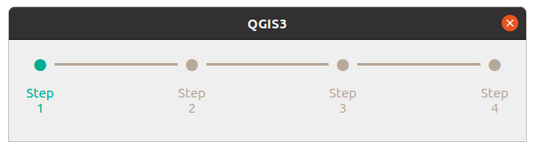
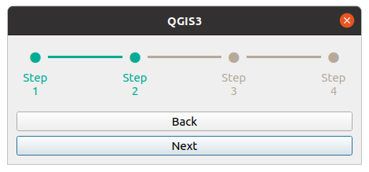

==============
QGIS Steps Bar
==============
QGIS Steps Bar is a QWidget. It depends on the QT library on your machine that compiles QGIS.
It requires QGIS 3.4 or above.

Usage
=====
Installation
------------
.. code-block:: shell

    pip install qgisstepsbar

Import
------
.. code-block:: shell

    from qgisstepsbar import QgisStepsBar

Sample Code
-----------
The following code shows how to add the QGIS Steps Bar into layout:

.. code-block:: shell

    from qgisstepsbar import QgisStepsBar
    from qgis.PyQt.QtWidgets import QDialog, QVBoxLayout

    class Dialog(QDialog):
        def __init__(self):
            super().__init__()
            self.layout = QVBoxLayout()
            self.setLayout(self.layout)

            self.stepsbar = QgisStepsBar(["Step1", "Step 2", "Step 3", "Step 4"])
            self.layout.addWidget(self.stepsbar)

    dialog = Dialog()
    dialog.show()

The following code shows how to control the QGIS Steps Bar:

.. code-block:: shell

    from qgisstepsbar import QgisStepsBar
    from qgis.PyQt.QtWidgets import QDialog, QVBoxLayout, QPushButton

    class BackButton(QPushButton):
        def __init__(self, stepsbar):
            super().__init__("Back")
            self.clicked.connect(stepsbar.decrement)

    class NextButton(QPushButton):
        def __init__(self, stepsbar):
            super().__init__("Next")
            self.clicked.connect(stepsbar.increment)

    class Dialog(QDialog):
        def __init__(self):
            super().__init__()
            self.layout = QVBoxLayout()
            self.setLayout(self.layout)

            self.stepsbar = QgisStepsBar(["Step1", "Step 2", "Step 3", "Step 4"])
            self.layout.addWidget(self.stepsbar)

            self.back_button = BackButton(self.stepsbar)
            self.layout.addWidget(self.back_button)

            self.next_button = NextButton(self.stepsbar)
            self.layout.addWidget(self.next_button)

    dialog = Dialog()
    dialog.show()

Development
===========

Poetry Installation
-------------------
Peotry is a Python project management tool. QGIS Steps Bar uses Peotry to deploy packages to PyPI.
To install:

.. code-block:: shell

    curl -sSL https://raw.githubusercontent.com/python-poetry/poetry/master/get-poetry.py | python

Poetry Commands
----------------------
You must use Python 3 for this project. If you have Python 2 installed, make sure Peotry is running on Python 3 by:

.. code-block:: shell

    poetry env use /your/path/to/python3

For a list of commands, refer to: https://python-poetry.org/docs/cli/

Deployment
----------
The following command builds the source and wheels archives:

.. code-block:: shell

    poetry build

This command publishes the package, previously built with the build command, to PyPI

.. code-block:: shell

    poetry publish

Different verisons can be found at PyPI: https://pypi.org/project/qgisstepsbar/
